# SyncAI × OpenClaw Architectural Patterns — Implementation Plans (v1)

Audience: SyncAI platform engineering (Supabase/Postgres/Edge Functions) building industrial AI infrastructure (O&G/Mining/Petrochemical).

This document maps proven OpenClaw patterns onto the current SyncAI codebase (notably `supabase/functions/{javis-orchestrator, autonomous-orchestrator, ai-agent-processor, javis-event-listener, health-check}`) and proposes production-ready scaffolding, schema, migration phases, and expected performance/cost impacts.

---

## Baseline assumptions & constraints

- **Runtime:** Supabase Edge Functions (Deno), Postgres (Supabase), pgvector available.
- **Tenancy:** Most tables are tenant-scoped (`tenant_id`); keep all new schema tenant-aware.
- **Modes:** Assist / Copilot / Autonomous already exist conceptually (see `autonomous-orchestrator`’s approval logic). We formalize and generalize it.
- **Current orchestration:** Primarily monolithic calls (single agent response) via `ai-agent-processor`, and higher-level UX via `javis-orchestrator`.
- **Non-goal:** Replace existing MVP; we add a new orchestration layer that can call existing agent processors as workers.

---

# Core 5 Patterns (deep plans)

## 1) Multi-Agent Orchestration & Spawning

### 1.1 Architecture diagram (monolith → multi-agent)

```mermaid
flowchart LR
  U[UI / API] --> J[javis-orchestrator]
  J -->|today: single call| AIP[ai-agent-processor]
  AIP --> LLM[(LLM)]

  subgraph Target[Target Architecture]
    U2[UI / API] --> OM[orchestration-manager]
    OM -->|spawnAgent()| Q[(spawn_queue)]
    Q --> W1[agent-worker]
    Q --> W2[agent-worker]
    Q --> W3[agent-worker]
    W1 --> Tools[tool-registry]
    W2 --> Tools
    W3 --> Tools
    Tools --> Ext[CMMS / SCADA / Historian / ERP]

    W1 --> LLM2[(LLM)]
    W2 --> LLM2
    W3 --> LLM2

    W1 --> R[(agent_results)]
    W2 --> R
    W3 --> R

    R --> OM
    OM --> U2
  end
```

Key idea: Orchestrator creates a **parent session** and **spawns child agent sessions** into a queue. Workers process queued items in parallel, write results, and a coordinator aggregates.

### 1.2 Code scaffolding (TypeScript Edge Functions)

#### Proposed Edge Functions
- `supabase/functions/orchestration-manager/index.ts` — create sessions, spawn children, aggregate
- `supabase/functions/agent-worker/index.ts` — pick queued jobs, run agent, write result
- `supabase/functions/agent-complete-webhook/index.ts` — optional push-based completion for UI

#### Shared library layout
```
supabase/functions/_shared/orchestration/
  types.ts
  spawn.ts
  coordinator.ts
  selectors.ts
  errors.ts
```

#### `spawnAgent()` signature
```ts
export type AgentKey =
  | 'pdm' | 'rca' | 'rex' | 'tpm' | 'apm'
  | 'work_order' | 'spare_parts' | 'energy' | 'safety' | 'quality'
  | 'maintenance_planning' | 'equipment_lifecycle'
  | 'operator_training' | 'continuous_improvement' | 'iso_55000';

export interface SpawnAgentInput {
  tenantId: string;
  userId: string;
  parentSessionId: string;
  agent: AgentKey;
  task: {
    kind: 'investigation' | 'optimization' | 'planning' | 'compliance';
    query: string;
    assetId?: string;
    timeRange?: { from: string; to: string };
    attachments?: Array<{ type: 'doc' | 'image' | 'timeseries'; ref: string }>;
  };
  mode: 'assist' | 'copilot' | 'autonomous';
  priority?: number; // higher = sooner
  concurrencyKey?: string; // e.g. `${tenantId}:historian`
  idempotencyKey?: string; // safe retries
  callback?: {
    kind: 'none' | 'webhook';
    url?: string;
    secretRef?: string; // from credential manager
  };
}

export interface SpawnAgentOutput {
  childSessionId: string;
  queueId: string;
  status: 'queued';
}

export async function spawnAgent(
  supabase: SupabaseClient,
  input: SpawnAgentInput,
): Promise<SpawnAgentOutput> {
  // 1) insert into agent_sessions (child)
  // 2) insert into spawn_queue
  // 3) return IDs
  throw new Error('scaffold');
}
```

#### Session isolation
- Every child agent run has its own `agent_sessions` row and `session_context` snapshot.
- Workers read **only** their session’s context + tenant-scoped memory.
- Aggregator reads results from `agent_results` for the parent session.

#### Parallel execution coordinator
```ts
export interface CoordinateInput {
  tenantId: string;
  parentSessionId: string;
  wait?: { maxMs: number; pollMs: number };
}

export async function coordinate(
  supabase: SupabaseClient,
  input: CoordinateInput,
): Promise<{ status: 'complete'|'partial'|'timeout'; results: AgentResult[]; summary: string }>{
  // reads expected children from agent_sessions where parent_session_id = ...
  // computes completion %
  // optionally calls an LLM summarizer agent (lightweight) to produce final brief
  throw new Error('scaffold');
}
```

#### Auto-completion webhooks
- When a worker marks a child session `completed`, it optionally emits `agent_complete` webhook.
- Webhook payload includes: `tenant_id`, `parent_session_id`, `child_session_id`, `agent`, `status`, `result_ref`.

### 1.3 Database schema (migrations)

```sql
-- 01_agent_sessions.sql
create table if not exists public.agent_sessions (
  id uuid primary key default gen_random_uuid(),
  tenant_id uuid not null,
  user_id uuid,
  parent_session_id uuid,
  agent_key text not null,
  mode text not null check (mode in ('assist','copilot','autonomous')),
  status text not null default 'created' check (status in ('created','queued','running','completed','failed','cancelled')),
  priority int not null default 0,
  idempotency_key text,
  created_at timestamptz not null default now(),
  started_at timestamptz,
  completed_at timestamptz,
  error jsonb
);
create index if not exists agent_sessions_tenant_parent_idx on public.agent_sessions(tenant_id, parent_session_id);
create unique index if not exists agent_sessions_idempotency_uniq on public.agent_sessions(tenant_id, idempotency_key) where idempotency_key is not null;

-- 02_spawn_queue.sql
create table if not exists public.spawn_queue (
  id uuid primary key default gen_random_uuid(),
  tenant_id uuid not null,
  session_id uuid not null references public.agent_sessions(id) on delete cascade,
  run_after timestamptz not null default now(),
  locked_at timestamptz,
  locked_by text,
  attempts int not null default 0,
  max_attempts int not null default 5,
  concurrency_key text,
  status text not null default 'queued' check (status in ('queued','locked','done','dead')),
  created_at timestamptz not null default now()
);
create index if not exists spawn_queue_pick_idx on public.spawn_queue(status, run_after, tenant_id);

-- 03_agent_results.sql
create table if not exists public.agent_results (
  id uuid primary key default gen_random_uuid(),
  tenant_id uuid not null,
  session_id uuid not null references public.agent_sessions(id) on delete cascade,
  parent_session_id uuid,
  agent_key text not null,
  result_json jsonb not null,
  citations jsonb,
  metrics jsonb,
  created_at timestamptz not null default now()
);
create index if not exists agent_results_parent_idx on public.agent_results(tenant_id, parent_session_id);
```

### 1.4 Migration strategy (Phase 1–3)

- **Phase 1 (introduce orchestration without changing agents):**
  - Add schema above.
  - Implement `orchestration-manager` that calls existing `ai-agent-processor` sequentially (no worker yet) but still writes to `agent_sessions/agent_results`.
  - Ship UI that shows “subtasks” and partial results.

- **Phase 2 (true parallelism):**
  - Implement `agent-worker` function + queue picker (Postgres advisory locks or `locked_at/locked_by`).
  - Run N workers via scheduled invocations (or external worker) to simulate concurrency.
  - Update manager to spawn all children quickly and then wait/return immediately (async UI polling).

- **Phase 3 (specialized routing + tool use):**
  - Add concurrency keys per integration (historian, cmms) and per-tenant budgets.
  - Add auto-completion webhook for event-driven UI updates.

### 1.5 Performance benchmarks (expected)

Assume:
- LLM call p50=2.5s, p95=8s; overhead 200ms.

| Scenario | Agents | Execution | p50 total | p95 total | Notes |
|---|---:|---|---:|---:|---|
| Monolith | 1 | sequential | ~2.7s | ~8.2s | today |
| Investigation | 3 | sequential | ~8.1s | ~24.6s | PdM+RCA+REX |
| Investigation | 3 | parallel | ~3.2s | ~9.0s | +aggregation |
| Full round-up | 15 | sequential | ~40s | 2–3 min | unacceptable |
| Full round-up | 15 | parallel (5 workers) | ~10–15s | ~25–35s | constrained by workers + rate limits |

### 1.6 Example use cases
- **Asset failure investigation:** spawn `pdm`, `rca`, `rex` concurrently; coordinator returns a single executive brief + engineering action list.
- **Shutdown planning:** spawn `tpm`, `maintenance_planning`, `work_order`, `spare_parts` for a 7-day plan and materials staging.
- **KPI optimization:** spawn `energy`, `quality`, `continuous_improvement` + `rex` to produce 30/60/90-day initiatives.
- **Safety incident:** spawn `safety`, `rca`, `compliance(iso_55000)` for immediate actions + report draft.

### 1.7 Integration points in current SyncAI
- Reuse prompting and model selection logic from `supabase/functions/ai-agent-processor`.
- `javis-orchestrator` becomes a thin UX API that delegates to `orchestration-manager`.
- `autonomous-orchestrator` becomes an event source (spawn on anomaly) and a consumer (approve/execute tools).

---

## 2) Memory System with Semantic Search (Hybrid semantic memory)

### 2.1 Architecture diagram (RAG → hybrid semantic memory)

```mermaid
flowchart TD
  S[Sources
  work_orders, logs,
  rca_reports, procedures,
  manuals, historian summaries] --> Q1[Embedding Queue]
  Q1 --> EP[Embedding Pipeline]
  EP --> MI[(memory_index: pgvector + metadata)]
  S --> FTS[(FTS columns / tsvector)]

  Agent[Agents] --> MS[memorySearch()]
  MS -->|vector kNN| MI
  MS -->|fts| FTS
  MS -->|hybrid rerank| RR[Reranker]
  RR --> Agent

  Cache[(semantic_cache)] <-- MS
```

### 2.2 Code scaffolding

#### APIs
- `supabase/functions/memory-search/index.ts` (new) → exposes `memorySearch()`
- `supabase/functions/memory-indexer/index.ts` (new) → processes `embedding_queue`

#### `memorySearch()` interface
```ts
export interface MemorySearchInput {
  tenantId: string;
  query: string;
  topK?: number;
  filters?: {
    assetId?: string;
    sourceTypes?: string[]; // work_order, rca_report, manual, procedure...
    timeFrom?: string;
    timeTo?: string;
  };
  hybrid?: { vectorWeight: number; ftsWeight: number };
}

export interface MemoryHit {
  id: string;
  source_type: string;
  source_id: string;
  asset_id?: string;
  title?: string;
  snippet: string;
  score: number;
  citations: any;
}

export async function memorySearch(supabase: SupabaseClient, input: MemorySearchInput): Promise<MemoryHit[]> {
  // 1) semantic_cache lookup by (tenantId, normalized query, filters)
  // 2) vector search in memory_index using pgvector
  // 3) FTS search in memory_index.content_tsv
  // 4) merge + rerank
  // 5) store cache
  throw new Error('scaffold');
}
```

#### Vector indexing pipeline
- When new work order / RCA report / uploaded document chunk arrives:
  - write row to `embedding_queue`
  - indexer picks jobs, generates embedding, writes to `memory_index`

### 2.3 Database schema

```sql
-- 01_memory_index.sql
create table if not exists public.memory_index (
  id uuid primary key default gen_random_uuid(),
  tenant_id uuid not null,
  source_type text not null,
  source_id uuid not null,
  asset_id uuid,
  title text,
  content text not null,
  content_tsv tsvector generated always as (to_tsvector('english', coalesce(content,''))) stored,
  embedding vector(1536),
  metadata jsonb not null default '{}'::jsonb,
  created_at timestamptz not null default now(),
  updated_at timestamptz not null default now()
);
create index if not exists memory_index_tenant_source_idx on public.memory_index(tenant_id, source_type, source_id);
create index if not exists memory_index_tsv_idx on public.memory_index using gin(content_tsv);
-- vector index (choose ivfflat/hnsw depending on pgvector version)
create index if not exists memory_index_vec_idx on public.memory_index using hnsw (embedding vector_cosine_ops);

-- 02_embedding_queue.sql
create table if not exists public.embedding_queue (
  id uuid primary key default gen_random_uuid(),
  tenant_id uuid not null,
  source_type text not null,
  source_id uuid not null,
  payload jsonb not null,
  status text not null default 'queued' check (status in ('queued','processing','done','error')),
  locked_at timestamptz,
  locked_by text,
  attempts int not null default 0,
  error text,
  created_at timestamptz not null default now()
);
create index if not exists embedding_queue_pick_idx on public.embedding_queue(status, created_at);

-- 03_semantic_cache.sql
create table if not exists public.semantic_cache (
  id uuid primary key default gen_random_uuid(),
  tenant_id uuid not null,
  cache_key text not null,
  query text not null,
  filters jsonb,
  results jsonb not null,
  valid_until timestamptz not null,
  created_at timestamptz not null default now()
);
create unique index if not exists semantic_cache_key_uniq on public.semantic_cache(tenant_id, cache_key);
```

### 2.4 Integration points
- Existing `rag-semantic-search` and `rag-document-processor` can be refactored to populate `memory_index`.
- `javis-orchestrator` currently uses `.textSearch` on `knowledge_base_chunks`; augment to call `memorySearch()` for consistent access to both KB + operational logs.

### 2.5 pgvector vs sqlite-vec (pragmatic guidance)
- **pgvector (Supabase):** best for multi-tenant centralized search, RLS, joins to asset/work order tables, operational simplicity.
- **sqlite-vec:** useful for edge/offline agent runtimes or on-prem gateways; not ideal as the primary store given Supabase centralization.
- Recommendation: **pgvector primary**, optional sqlite-vec for customer on-prem “cache node” later.

### 2.6 Example queries
- “Similar pump failures in last 6 months” → filter `asset_id` optional, `source_type` includes `work_order`, `rca_report`.
- “Procedures for high-temperature shutdowns” → `source_type` in `procedure`, `manual`.
- “Root causes of bearing failures on centrifugal compressors” → hybrid query + rerank.

### 2.7 Performance/cost impact
- Hybrid search reduces LLM context size (fewer irrelevant chunks), lowering token spend by **20–40%** on long investigations.
- Cache (5–15 min) for repeated queries across spawned agents reduces embedding + query overhead.

---

## 3) Tool Calling Architecture (agent → tools → industrial systems)

### 3.1 Architecture diagram

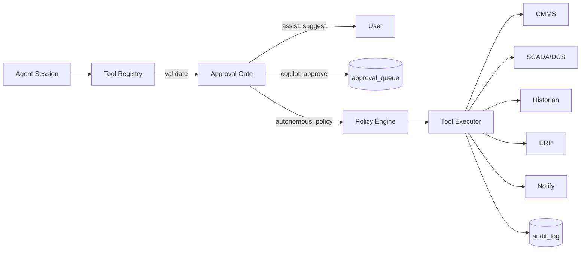

### 3.2 Tool schema definitions (20+)

Define tools as JSONSchema-ish contracts for validation and UI rendering.

**CMMS (read/write)**
- `cmms.get_work_order`
- `cmms.search_work_orders`
- `cmms.create_work_order` (write)
- `cmms.update_work_order_status` (write)
- `cmms.assign_technician` (write)

**SCADA/DCS (read/write)**
- `scada.get_tag`
- `scada.get_alarm_list`
- `scada.ack_alarm` (write)
- `scada.set_setpoint` (write)

**Historian (read/compute)**
- `historian.query_timeseries`
- `historian.aggregate`
- `historian.detect_anomaly`

**ERP / Inventory**
- `erp.get_inventory_level`
- `erp.reserve_parts` (write)
- `erp.create_purchase_requisition` (write)

**Notifications**
- `notify.send_email`
- `notify.send_sms`
- `notify.send_slack`
- `notify.send_teams`
- `notify.send_whatsapp`

**Safety/Compliance**
- `hse.create_incident_record` (write)
- `compliance.schedule_inspection` (write)

### 3.3 Approval gate system (Assist/Copilot/Autonomous)

- **Assist:** tool calls are rendered as suggestions only; no execution.
- **Copilot:** tool calls require explicit human approval; stored in `approval_queue`.
- **Autonomous:** tool calls allowed if policy passes (asset criticality, blast radius, time window, confidence), otherwise routed to approval.

### 3.4 Security & validation
- Parameter validation: JSON schema + allowlists + range checks (e.g., setpoints).
- Rate limiting: reuse `functions/_shared/rate-limiter.ts` and add per-integration keys.
- Audit logging: every tool call writes `tool_audit_log` with before/after, requester session, approval record.

### 3.5 Code scaffolding

```
supabase/functions/_shared/tools/
  registry.ts
  schemas.ts
  executor.ts
  approvals.ts
  policies.ts
  audit.ts
```

```ts
export interface ToolCall {
  tool: string; // e.g. 'cmms.create_work_order'
  args: Record<string, unknown>;
  mode: 'assist'|'copilot'|'autonomous';
  tenantId: string;
  userId: string;
  sessionId: string;
}

export async function runToolCall(supabase: SupabaseClient, call: ToolCall) {
  // 1) validate args against schema
  // 2) compute risk score
  // 3) if needs approval => enqueue + return proposal
  // 4) else execute via adapter
  // 5) audit log
}
```

### 3.6 Database schema

```sql
create table if not exists public.approval_queue (
  id uuid primary key default gen_random_uuid(),
  tenant_id uuid not null,
  session_id uuid,
  tool text not null,
  args jsonb not null,
  risk_score numeric not null default 0,
  status text not null default 'pending' check (status in ('pending','approved','rejected','expired','executed')),
  requested_by uuid,
  requested_at timestamptz not null default now(),
  decision_by uuid,
  decision_at timestamptz,
  expires_at timestamptz
);
create index if not exists approval_queue_tenant_status_idx on public.approval_queue(tenant_id, status);

create table if not exists public.tool_audit_log (
  id uuid primary key default gen_random_uuid(),
  tenant_id uuid not null,
  session_id uuid,
  tool text not null,
  args jsonb not null,
  result jsonb,
  success boolean not null,
  approval_id uuid,
  created_at timestamptz not null default now()
);
create index if not exists tool_audit_tenant_tool_idx on public.tool_audit_log(tenant_id, tool, created_at);
```

### 3.7 Migration path
- Start **read-only tools** (historian queries, CMMS search) in Assist mode.
- Add Copilot approvals for write actions (create WO, assign tech).
- Add Autonomous policies for low-risk actions (e.g., reserve parts under $ threshold).

### 3.8 Example industrial scenarios
- PdM detects anomaly → proposes `cmms.create_work_order` (copilot approval).
- Operator requests alarm silence → `scada.ack_alarm` requires copilot unless non-critical.
- Spare parts agent detects stock-out → `erp.create_purchase_requisition` w/ budget policy.

### 3.9 Performance/cost
- Tools reduce LLM hallucination and rework; expected **10–25%** reduction in human time spent “translating” recommendations into systems.

---

## 4) Event-Driven Automation

### 4.1 Architecture diagram

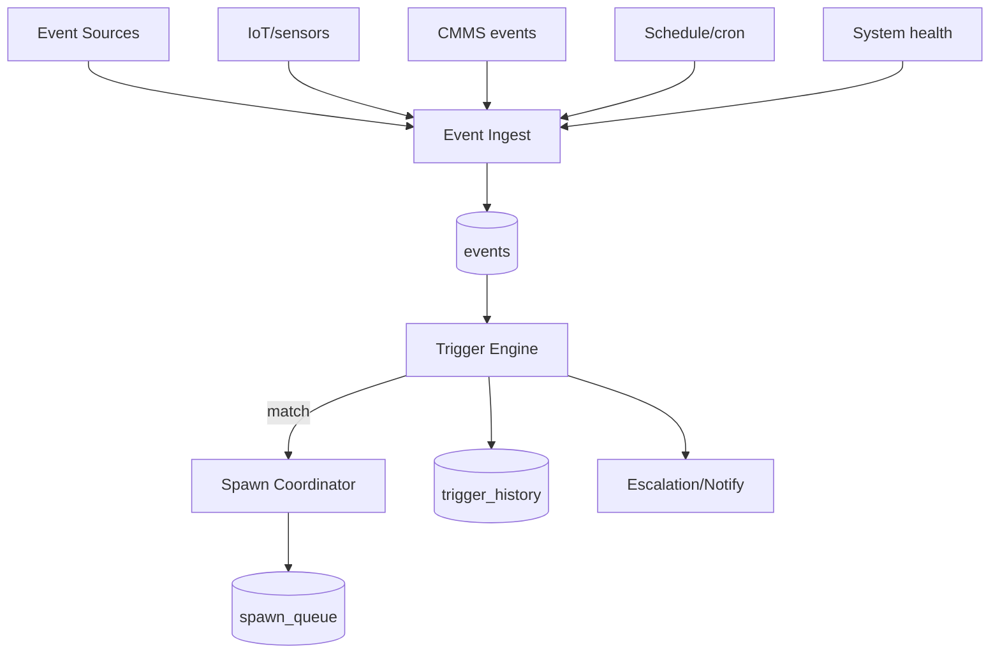

### 4.2 Event types
- **Real-time sensors:** threshold + duration windows
- **Scheduled inspections:** cron rules
- **Heartbeats:** periodic batch checks per critical asset class
- **System events:** overdue work order, stock-out, compliance deadline

### 4.3 Trigger engine (condition eval, debouncing, escalation)

Rules include:
- `condition` (SQL-ish expression or JSONLogic)
- `debounce` (don’t fire again for N minutes)
- `escalation` (severity-based routing)

### 4.4 Code scaffolding

- `supabase/functions/event-ingest/index.ts` — accept events
- `supabase/functions/trigger-engine/index.ts` — evaluate triggers
- Reuse existing `javis-event-listener` patterns.

```ts
export interface EventEnvelope {
  tenantId: string;
  type: string; // 'sensor.temperature'
  source: string; // 'pi-historian'
  occurredAt: string;
  assetId?: string;
  payload: any;
}
```

### 4.5 Database schema

```sql
create table if not exists public.events (
  id uuid primary key default gen_random_uuid(),
  tenant_id uuid not null,
  type text not null,
  source text,
  asset_id uuid,
  occurred_at timestamptz not null,
  payload jsonb not null,
  created_at timestamptz not null default now()
);
create index if not exists events_tenant_type_time_idx on public.events(tenant_id, type, occurred_at desc);

create table if not exists public.event_triggers (
  id uuid primary key default gen_random_uuid(),
  tenant_id uuid not null,
  name text not null,
  enabled boolean not null default true,
  event_type text not null,
  condition jsonb not null,
  debounce_seconds int not null default 300,
  action jsonb not null, -- {spawn: {...}} or {notify: {...}}
  created_at timestamptz not null default now()
);

create table if not exists public.trigger_history (
  id uuid primary key default gen_random_uuid(),
  tenant_id uuid not null,
  trigger_id uuid not null references public.event_triggers(id) on delete cascade,
  event_id uuid references public.events(id),
  fired_at timestamptz not null default now(),
  status text not null default 'fired',
  details jsonb
);
create index if not exists trigger_history_tenant_trigger_idx on public.trigger_history(tenant_id, trigger_id, fired_at desc);
```

### 4.6 Example configurations
- `sensor.temperature` where `payload.value > 85` for `>= 5 min` → spawn PdM.
- Weekly Monday 08:00 → spawn TPM weekly inspection plan.
- Every 15 min → batch health check all critical assets (spawn `asset_health` agent per area).

### 4.7 Migration strategy
- Phase 1: schedule-based triggers only (safe, deterministic).
- Phase 2: system events (work order overdue, stock-out).
- Phase 3: sensor streaming with debouncing + suppression rules.

### 4.8 Performance/cost
- Moves from reactive to proactive; reduces unplanned downtime; compute costs increase but bounded via debouncing + priority queues.

---

## 5) Session Management & Context Persistence

### 5.1 Architecture diagram

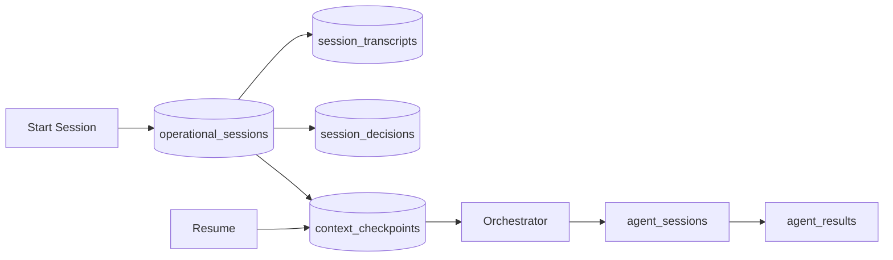

### 5.2 Session types
- Investigation, Optimization, Planning, Compliance

### 5.3 Context persistence
- Every user/agent message appended to transcripts.
- Periodic checkpoints store summarized context to enable resume without replaying everything.
- Decisions table stores approvals, tool calls, and “why” rationale for audit.

### 5.4 Code scaffolding

```
supabase/functions/_shared/sessions/
  manager.ts
  serializer.ts
  checkpoint.ts
  resume.ts
```

```ts
export interface SessionStartInput {
  tenantId: string;
  userId: string;
  type: 'investigation'|'optimization'|'planning'|'compliance';
  title: string;
  assetId?: string;
}
```

### 5.5 Database schema

```sql
create table if not exists public.operational_sessions (
  id uuid primary key default gen_random_uuid(),
  tenant_id uuid not null,
  user_id uuid,
  type text not null,
  title text not null,
  asset_id uuid,
  status text not null default 'active' check (status in ('active','closed','archived')),
  created_at timestamptz not null default now(),
  updated_at timestamptz not null default now()
);

create table if not exists public.session_transcripts (
  id uuid primary key default gen_random_uuid(),
  tenant_id uuid not null,
  session_id uuid not null references public.operational_sessions(id) on delete cascade,
  role text not null check (role in ('user','agent','tool')),
  message text not null,
  metadata jsonb,
  created_at timestamptz not null default now()
);
create index if not exists session_transcripts_session_idx on public.session_transcripts(tenant_id, session_id, created_at);

create table if not exists public.session_decisions (
  id uuid primary key default gen_random_uuid(),
  tenant_id uuid not null,
  session_id uuid not null references public.operational_sessions(id) on delete cascade,
  decision_type text not null,
  decision jsonb not null,
  rationale text,
  created_at timestamptz not null default now()
);

create table if not exists public.context_checkpoints (
  id uuid primary key default gen_random_uuid(),
  tenant_id uuid not null,
  session_id uuid not null references public.operational_sessions(id) on delete cascade,
  checkpoint_kind text not null, -- 'summary','state'
  content jsonb not null,
  token_estimate int,
  created_at timestamptz not null default now()
);
```

### 5.6 Audit & compliance
- Use decision trails + tool audit logs for ISO 55000/55001 traceability.
- Provide “forensic replay”: reconstruct who approved what and why.

### 5.7 Migration strategy
- Phase 1: log transcripts for orchestrated sessions only.
- Phase 2: add checkpoints and resume.
- Phase 3: enforce decisions for autonomous actions.

---

# Additional 8 High-Value Patterns

## 6) Skills System (Modular Capabilities)

### 6.1 Architecture diagram

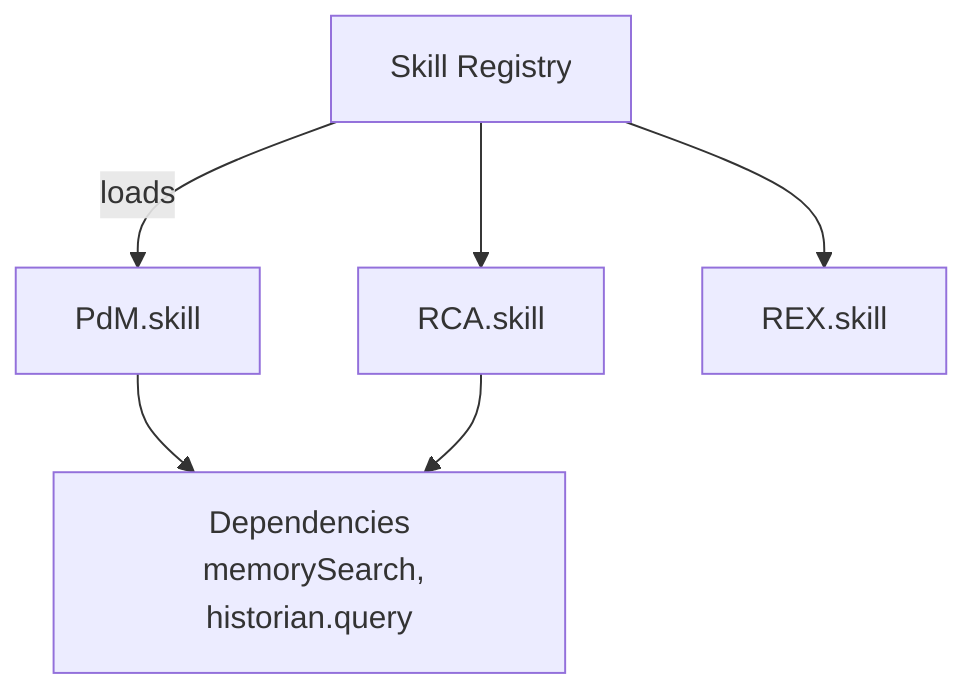

### 6.2 Code scaffolding

```
supabase/functions/_shared/skills/
  registry.ts
  loader.ts
  types.ts
skills/
  pdm/SKILL.md
  rca/SKILL.md
  ...
```

```ts
export interface Skill {
  key: string;
  name: string;
  version: string;
  description: string;
  dependsOn: string[];
  run: (ctx: SkillContext) => Promise<SkillOutput>;
}
```

### 6.3 DB schema

```sql
create table if not exists public.skill_versions (
  id uuid primary key default gen_random_uuid(),
  tenant_id uuid,
  skill_key text not null,
  version text not null,
  manifest jsonb not null,
  enabled boolean not null default true,
  created_at timestamptz not null default now()
);
create unique index if not exists skill_versions_uniq on public.skill_versions(coalesce(tenant_id, '00000000-0000-0000-0000-000000000000'::uuid), skill_key, version);
```

### 6.4 Migration strategy
- Start with static registry mapping to existing `ai-agent-processor` prompt builder.
- Later allow tenant overrides (custom skill manifests).

### 6.5 Use cases
- Customer-specific PdM tuning (different assets, standards).
- Mining vs O&G compliance packs.

### 6.6 Performance/cost
- Faster iteration and safer rollbacks; fewer regressions.

---

## 7) Multi-Channel Notifications

### 7.1 Architecture diagram

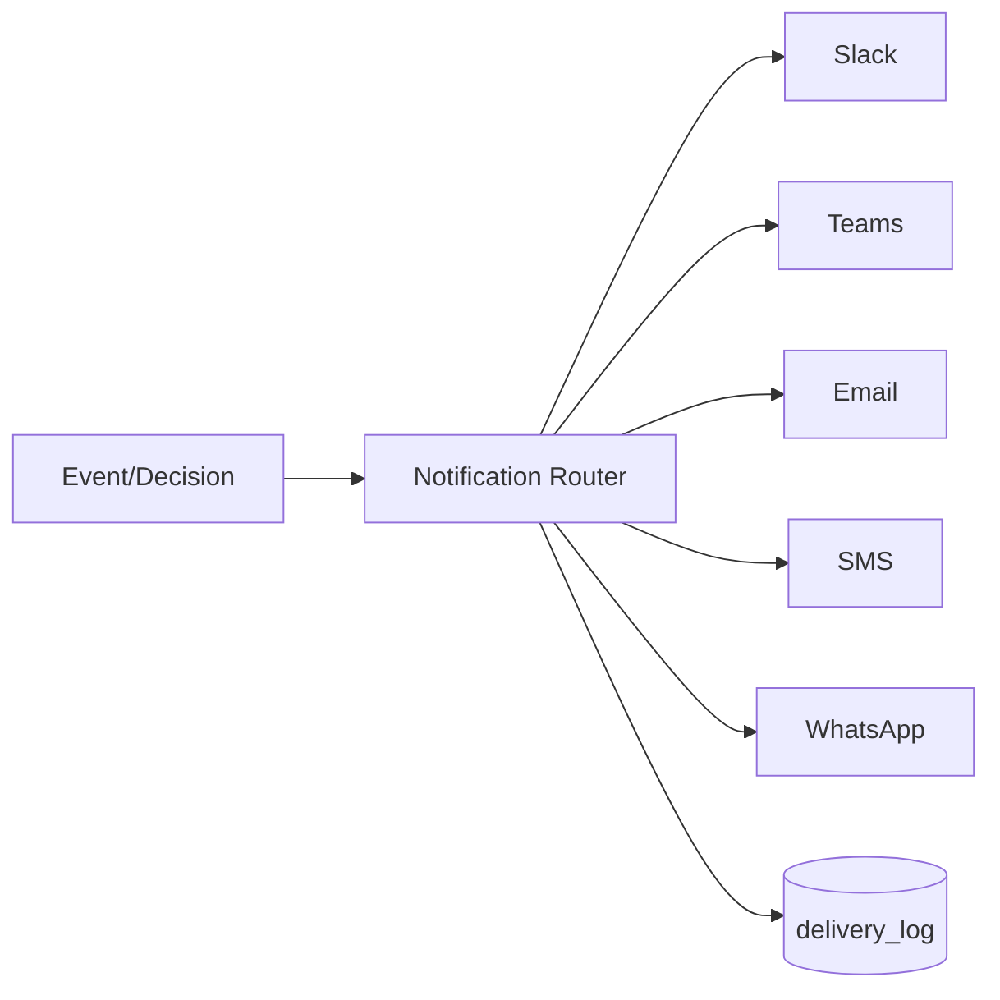

### 7.2 Code scaffolding

```
supabase/functions/_shared/notify/
  router.ts
  adapters/slack.ts
  adapters/teams.ts
  adapters/email.ts
  adapters/sms.ts
  adapters/whatsapp.ts
  retry.ts
```

### 7.3 DB schema

```sql
create table if not exists public.notification_routes (
  id uuid primary key default gen_random_uuid(),
  tenant_id uuid not null,
  severity text not null,
  channels text[] not null,
  created_at timestamptz not null default now()
);

create table if not exists public.notification_delivery_log (
  id uuid primary key default gen_random_uuid(),
  tenant_id uuid not null,
  channel text not null,
  target text,
  payload jsonb not null,
  status text not null,
  attempts int not null default 0,
  last_error text,
  created_at timestamptz not null default now()
);
```

### 7.4 Migration
- Start with in-app + email; add Slack/Teams; then SMS/WhatsApp for critical.

---

## 8) Credential Management

### 8.1 Architecture diagram

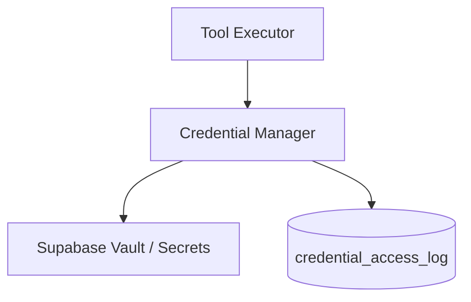

### 8.2 Code scaffolding

```
supabase/functions/_shared/creds/
  manager.ts
  providers/supabase-vault.ts
  providers/env.ts
  audit.ts
```

### 8.3 DB schema

```sql
create table if not exists public.credential_access_log (
  id uuid primary key default gen_random_uuid(),
  tenant_id uuid,
  secret_ref text not null,
  accessed_by uuid,
  purpose text,
  created_at timestamptz not null default now()
);
```

### 8.4 Migration
- Phase 1: wrap existing env var usage (OPENAI_API_KEY).
- Phase 2: tenant-scoped credentials for CMMS/SCADA.

---

## 9) Self-Diagnostic Health Checks

### 9.1 Architecture diagram

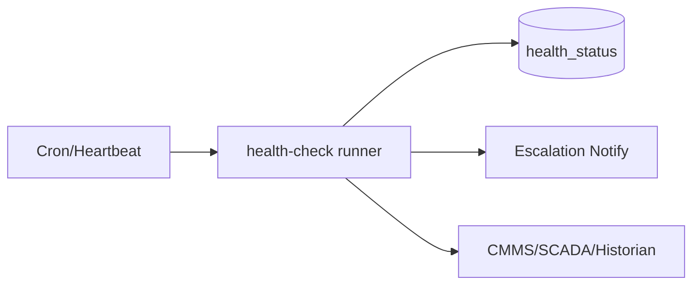

### 9.2 Code scaffolding

- Extend existing `supabase/functions/health-check/index.ts` into a registry-driven runner.

```ts
export interface HealthCheck {
  key: string;
  run: () => Promise<{ ok: boolean; latencyMs: number; details?: any }>;
}
```

### 9.3 DB schema

```sql
create table if not exists public.health_status (
  id uuid primary key default gen_random_uuid(),
  tenant_id uuid,
  check_key text not null,
  ok boolean not null,
  latency_ms int,
  details jsonb,
  created_at timestamptz not null default now()
);
create index if not exists health_status_key_time_idx on public.health_status(check_key, created_at desc);
```

### 9.4 Migration
- Start with DB + LLM connectivity checks.
- Add CMMS/historian probes per tenant.

---

## 10) Agent Personas & Specialization

### 10.1 Architecture diagram

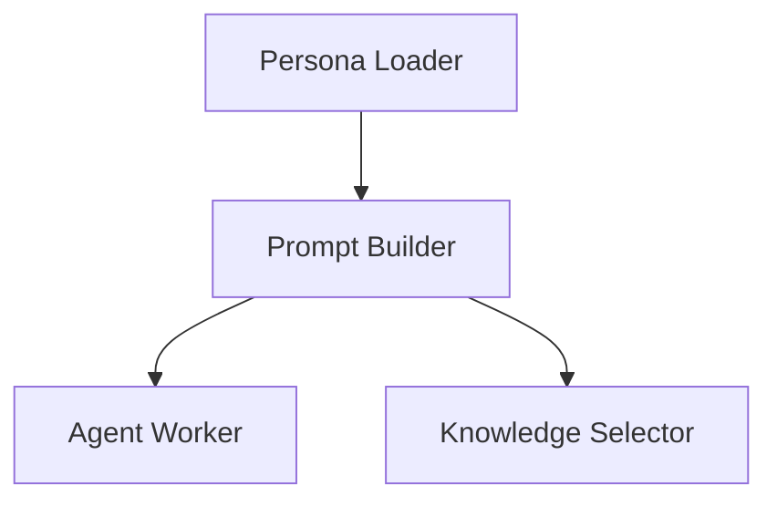

### 10.2 Code scaffolding

- `skills/<agent>/SOUL.md` and optional `PROMPT.md`.
- Prompt builder merges: base safety + tenant policy + persona + task.

### 10.3 DB schema

```sql
create table if not exists public.agent_personas (
  id uuid primary key default gen_random_uuid(),
  tenant_id uuid,
  agent_key text not null,
  persona jsonb not null,
  enabled boolean not null default true,
  created_at timestamptz not null default now()
);
```

### 10.4 Migration
- Start with static prompts (already in `ai-agent-processor`).
- Move to persona definitions stored per tenant for customization.

---

## 11) Error Recovery & Resilience

### 11.1 Architecture diagram

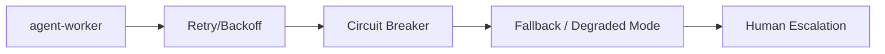

### 11.2 Code scaffolding

- Shared `retry.ts` and `circuitBreaker.ts` used by tools + LLM calls.

```ts
export async function withRetry<T>(fn: () => Promise<T>, opts: { max: number; baseMs: number }): Promise<T> {}
export function circuitBreaker(key: string): { allow(): Promise<boolean>; record(ok: boolean): Promise<void> } {}
```

### 11.3 DB schema

```sql
create table if not exists public.circuit_breakers (
  id uuid primary key default gen_random_uuid(),
  tenant_id uuid,
  key text not null,
  state text not null default 'closed' check (state in ('closed','open','half_open')),
  fail_count int not null default 0,
  opened_at timestamptz,
  updated_at timestamptz not null default now()
);
create unique index if not exists circuit_breakers_uniq on public.circuit_breakers(coalesce(tenant_id,'00000000-0000-0000-0000-000000000000'::uuid), key);
```

### 11.4 Migration
- Phase 1: retries for LLM + queue.
- Phase 2: breaker for flaky integrations.

---

## 12) Cost & Token Tracking

### 12.1 Architecture diagram

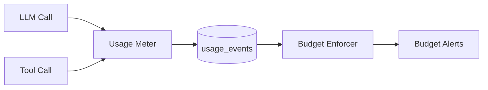

### 12.2 Code scaffolding

- Wrap `callOpenAI()` to capture tokens/cost (provider usage fields).

```ts
export interface UsageEvent {
  tenantId: string;
  sessionId: string;
  kind: 'llm'|'tool'|'storage';
  units: number;
  costUsd: number;
  metadata?: any;
}
```

### 12.3 DB schema

```sql
create table if not exists public.usage_events (
  id uuid primary key default gen_random_uuid(),
  tenant_id uuid not null,
  session_id uuid,
  kind text not null,
  units numeric not null,
  cost_usd numeric not null,
  metadata jsonb,
  created_at timestamptz not null default now()
);
create index if not exists usage_events_tenant_time_idx on public.usage_events(tenant_id, created_at desc);

create table if not exists public.tenant_budgets (
  tenant_id uuid primary key,
  monthly_budget_usd numeric not null,
  hard_limit boolean not null default false,
  updated_at timestamptz not null default now()
);
```

### 12.4 Migration
- Phase 1: log usage only.
- Phase 2: soft alerts.
- Phase 3: throttling + hard limits.

---

## 13) Queue Management & Rate Limiting

### 13.1 Architecture diagram

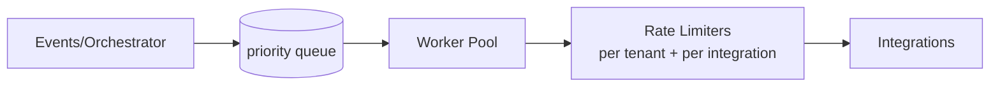

### 13.2 Code scaffolding

- Reuse `_shared/rate-limiter.ts` already present.
- Add queue picking with priorities + concurrency keys.

```ts
export async function pickNextJob(supabase: SupabaseClient, opts: {
  tenantId?: string;
  workerId: string;
  maxConcurrencyPerKey: Record<string, number>;
}): Promise<SpawnQueueRow | null> {}
```

### 13.3 DB schema

(Uses `spawn_queue` plus optional per-integration limiter state)

```sql
create table if not exists public.integration_rate_limits (
  id uuid primary key default gen_random_uuid(),
  tenant_id uuid,
  integration_key text not null,
  window_seconds int not null,
  max_requests int not null,
  state jsonb not null,
  updated_at timestamptz not null default now()
);
create unique index if not exists integration_rate_limits_uniq on public.integration_rate_limits(coalesce(tenant_id,'00000000-0000-0000-0000-000000000000'::uuid), integration_key);
```

### 13.4 Migration
- Phase 1: simple queue + FIFO.
- Phase 2: priority + per-tenant caps.
- Phase 3: per-integration concurrency keys.

### 13.5 Use cases
- 1000 sensor alerts burst → queue + debounce + priorities.
- Historian API limit → concurrency key throttling.

---

# Implementation Roadmap (18–24 weeks)

## Phase 1 — Quick Wins (4–6 weeks): Patterns 1, 2, 6

1) **Orchestration tables + manager** (Pattern 1):
- Create `agent_sessions`, `spawn_queue`, `agent_results`.
- Implement `orchestration-manager` that spawns 3–5 agents for investigation use cases.

2) **Memory hybrid search MVP** (Pattern 2):
- Create `memory_index`, `embedding_queue`, `semantic_cache`.
- Index current `knowledge_base_chunks` into `memory_index`.

3) **Skills registry** (Pattern 6):
- Manifest-driven mapping from agent key → prompt builder + dependencies.

Deliverable: multi-agent investigation that returns coordinated brief with citations.

## Phase 2 — Core Infrastructure (8–10 weeks): Patterns 3, 4, 5, 9, 11

- Tool registry + approvals + audit.
- Event ingest + triggers + spawn coordination.
- Operational sessions + transcripts + checkpoints.
- Health check registry and circuit breakers.

Deliverable: event-triggered PdM → approval-gated WO creation; full audit trail.

## Phase 3 — Advanced Features (6–8 weeks): Patterns 7, 8, 10, 12, 13

- Notification router with delivery confirmations.
- Tenant credential manager.
- Persona/knowledge selectors.
- Usage metering + budgets.
- Queue priorities + per-integration rate limiting.

Deliverable: production-grade industrial AI platform with governance, cost control, and resilience.

---

# Notes on connecting to existing functions

- `ai-agent-processor`: becomes the **worker execution primitive** (or refactor into `_shared/llm/callOpenAI`).
- `autonomous-orchestrator`: becomes an **event producer** and an **approval consumer**.
- `rag-*` functions: fold into memory indexing and search.
- `_shared/rate-limiter.ts`: reuse everywhere.

---

# Next engineering decisions (to confirm)

1) Worker execution model: scheduled Edge Function invocations vs external worker container.
2) Embedding model dimension: match current embeddings (1536 for OpenAI text-embedding-3-small) and adjust `vector(n)`.
3) RLS strategy: whether `service_role` writes everything + application-level checks, or strict RLS.
4) Summarizer: dedicated coordinator agent vs deterministic merge + optional LLM.
